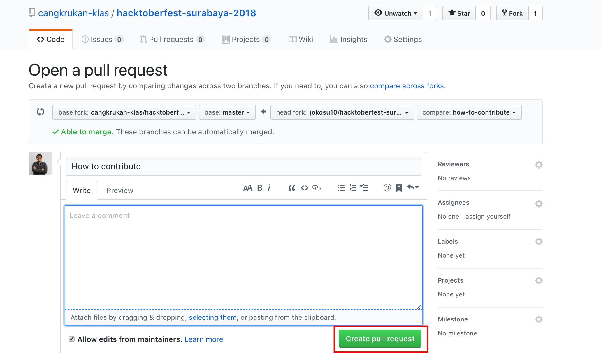

# hacktoberfest-surabaya-2018

Repository for hacktoberfest surabaya 2018 for that learn to contribute to open source project

+ **Is this data collection?**

No, this is only for learning purpose about git flow and open source contribution process.

+ **Do I need to attach my real name?**

No, just put any data. Non-sense, we just wanna learn about open source contribution.

+ **Do it on your own risk**

We don't collecting the data, but there is chance for other people abuse your data that submitted here. Please do it with your own risk, **we don't protect your data**.

## Step by step how to contribute

this is a way to contribute to the open-source project. Please enjoy 😀

### Fork repo to your repository

The first step is to create a **fork** of this repo. clicking on the **fork** button on the top of this page. A fork is basically your own working copy of this repository.


### Clone froked repo to machine

The next step is to clone the forked repo to your machine.

Go to your GitHub repositories and open the forked repository called hacktoberfest-surabaya-2018 (_forked from cangkrukan-klas/hacktoberfest-surabaya-2018_). Then click on the "Clone or download" button and then click the copy to clipboard icon to get your url.


Finally run the following git command in your terminal:

```sh
git clone "the copied url"
```

For example:

```sh
git clone https://github.com/jokosu10/hacktoberfest-surabaya-2018.git
```

You have now created a local clone on you computer. Good job!

### Create Branch In Local Computer

It's common practice to create a new branch for each new feature of bugfix you are working on. Let's go ahead and create one.

If you haven't already, start by changing your directory to the rebus catalog that was created when you run git clone:

```sh
cd hacktoberfest-surabaya-2018
```

create new branch for working. Running this command.

```sh
git checkout -b <your-new-branch-name>
```

> Note: Replace `your-new-branch-name` with something the changes you are about to make happen

For Example

```sh
git checkout -b add-my-profile
```

### Add your profile.md

Add your first file with file name `username-github.md` on the `peoples/` directory in that branch.

add your profile in `username-github.md` with syntax

```md
# My profile

* name : 'xxx',
* github : 'xxx',
* email : 'xxx@xxx.com'
```

### Committing your changes

Run git status to see which changes you have made. This will look something like:


Add these changes to your next commit by running:

```sh
git add .
```

To commit your changes, run:

```sh
git commit -m "Your message"
```

For example:

```sh
git commit -m "Add profile.md"
```

### Push your changes to Github

Push your changes to GitHub by running:

```sh
git push origin <your-new-branch-name>
```

> Note: Replace `<your-new-branch-name>` with the name of your branch

For example:

```sh
git push origin how-to-contribute"
```

This will look something like:


## Open a Pull Request

Head over to your repository on GitHub and click on the green "Compare and pull request" button.


Describe your changes and submit your pull request



-----

## License

Licensed under the MIT License.

-----